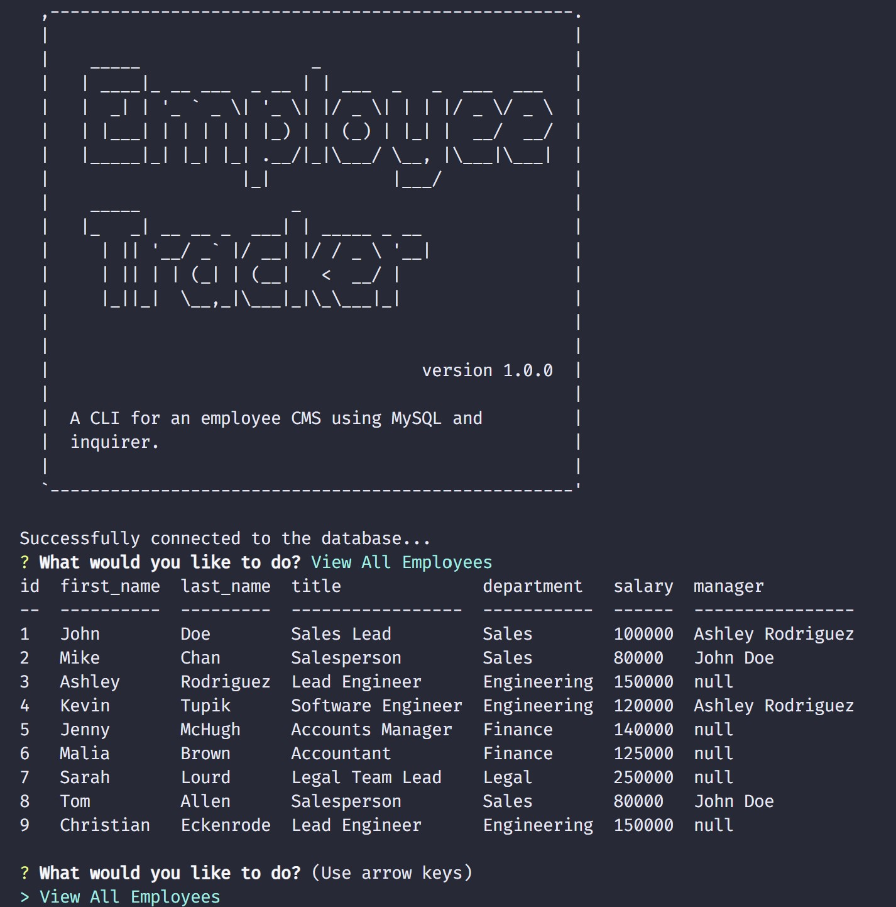

<!-- @format -->

# employee-tracker

A MySQL backed CMS using a CLI to manage employees in a fictional firm.

## User Story

Given the requirements for a database schema, the task was to create the schema sql script, supply seed data and provide a CLI interface which allows the user to:
<ul>
<li> Add departments, roles, employees</li>
<li> View departments, roles, employees</li>
<li> Update employee roles</li>
</ul>

Additional functionality was provided to"
<ul>
<li> Update employee managers</li>
<li> Delete departments, roles, and employees</li>
<li> View the total utilized budget of a department</li>
</ul>
NOTE: The deletion of departments and roles sets to NULL any used role_id in the employee table, rather than deleting the employee data.

## Built With

- [VScode](https://code.visualstudio.com/) - The editor of choice

#### Initial interface

### Licence

GNU General Public License v3.0

### Link to the github Repo

<a href="https://github.com/galluk/employee-tracker">Employee Tracker</a>

## Author

- **Luke Gallagher** -
  luke.gallagher.cst@gmail.com
